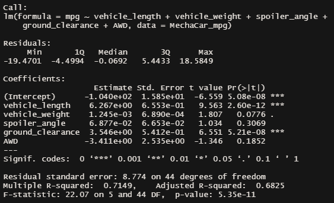
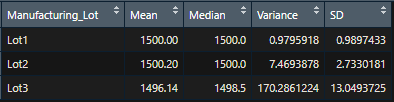
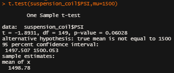
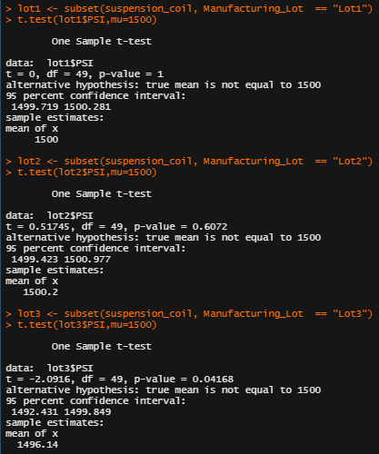

# MechaCar_Statistical_Analysis

## Linear Regression to Predict MPG

 
From the results of our multiple linear regression (shown above) we conclude the following. 
- According to our results vehicle length, ground clearance, as well as intercept are statistically unlikely to provide random amounts of variance to the linear model. Vehicle length and ground clearance have a significant impact on MPG. Since our intercept is statistically significant, we conclude there are other variables and factors that contribute to the variation in MPG that have not been included in our model. We may also conclude that we have not yet accounted for these variables/factors and that they still need to be collected or observed.
- Since the p-value of our linear regression is 5.35 x 10^-11, which is significantly smaller than our assumed significance level of 0.05, we can state that there is sufficient evidence to reject our null hypothesis, which means that the slope of our linear model is not zero. 
- Our r-squared value is ~.71, meaning roughly 71% of our MPG predictions will be accurate when using this linear model. While this is significant, as stated in our first bullet point above, there are significant variables that we have not yet accounted for that would make our predictive model even more accurate. 

## Summary Statistics on Suspension Coils

 

 
The design specifications for the MechaCar suspension coils dictate that the variance of the suspension coils must not exceed 100 pounds per square inch. 
- The variance accross all lots is equal to roughly 62.3 which is within our limit. 
- The individual lot variance for lot 1 and lot 2 meet the design specifications limits, lot 3 is well outside our specified limit with a variance of nearly 170.3.

## T-Tests on Suspension Coils

 

 
- When running a one sample t-test comparing PSI across all manufacturing lots to the population mean of 1,500 PSI we see that our p-value of .06 is just above our significance level (assuming the common significance level of .05). 
- When we run the same one sample t-test comparing each individual lot to the population mean we see that lot 1 and lot 2 are well above our significance level while lot 3 is below our significance level at .04. Because lot 3 is below our significance level we would reject the null hypothese and accept the alternative hypotheses. 

## Study Design: MechaCar vs Competition
1. We would like to collect the following metrics for MechaCar and its competition. 
   - Cost 
   - Maintenance Cost
   - Depreciation Cost
   - Max passengers 
   - Safety ratings 
   - Horse power
   - City fuel efficiency
   - Highway fuel efficiency 
   - Transmission
   - Cylinders
2. Our hypotesis:
   - The MechaCar has better fuel efficiency than the competition.  
   - Null hythothesis: The MechaCar performs the same or worse than the competition. 
3. I would compare the mean, median, variance, and standard deviation and run a two sample t-test to determine if there a statistical difference between the mean of the two samples. 
4. To run this test we would need sample city and highway fuel efficiency data for MechaCar as well as it's competition. 